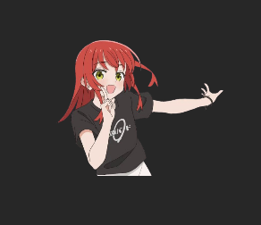
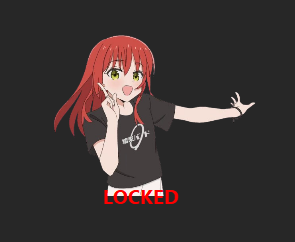
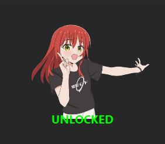

# ZX Anim



## Lock / Unlock State

 

A lightweight ZX animation overlay for osu!  
The animation reacts in real time to Z and X key inputs.

## Features
- Responsive ZX animation synced with key presses
- Lock / Unlock window position (HOME key)
- Custom animation frames and sounds
- OBS / screen recording compatible

## Build
```bash
pip install -r requirements.txt
pyinstaller --onefile --noconsole zx_anim.py
```

## Credits

- ZX animation frames are based on original artwork by **@11922960_ze**
