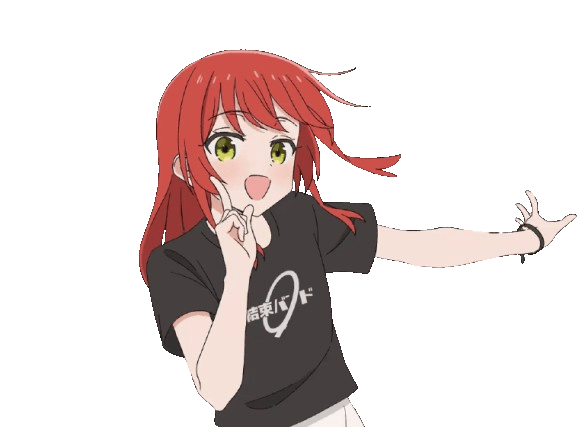

# ZX Anim



## Lock / Unlock State

 

A lightweight ZX animation overlay for osu!  
The animation reacts in real time to Z and X key inputs.

## Features
- Responsive ZX animation synced with key presses
- Lock / Unlock window position (HOME key)
- Custom animation frames and sounds
- OBS / screen recording compatible

## Build
```bash
pyinstaller --onefile --noconsole ^
--icon=icon.ico ^
--add-data "frames;frames" ^
--add-data "lock.wav;." ^
--add-data "unlock.wav;." ^
--name zx_anim ^
zx_anim.py
```

## Credits

- ZX animation frames are based on original artwork by **@11922960_ze**
