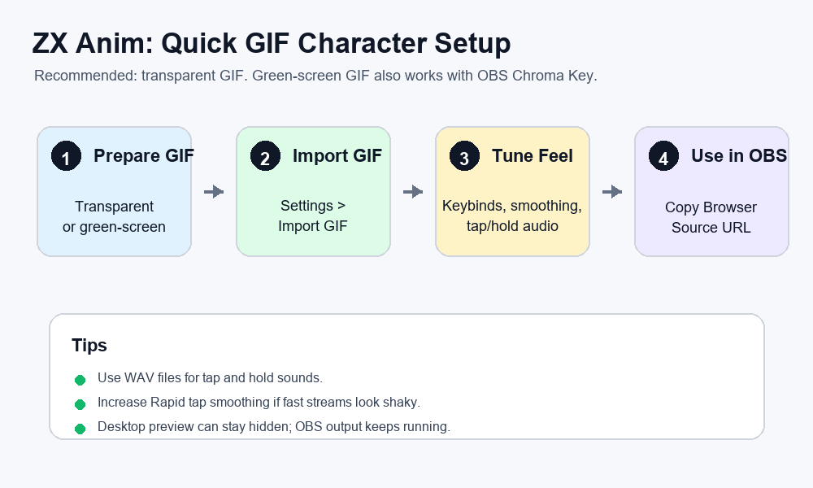

# ZX Anim

ZX Anim is a lightweight keyboard-reactive character overlay for rhythm games
and livestreams. It ships with Ikuyo Kita as the default character, supports
custom GIF imports, and outputs a transparent OBS Browser Source.


## Download

Open the latest GitHub Release and download one of these files:

- `ZX-Anim-3.1.0-Setup.exe` for the normal Windows installer.
- `ZX-Anim-3.1.0-Portable.zip` if you prefer a portable folder.

The installer is per-user and does not need administrator access.

## Features

- Keyboard-reactive animation for fast tapping and holds
- One-click GIF import for quick character setup
- Custom character packs with PNG frame actions
- Optional WAV sounds for tap and hold
- Rapid tap smoothing for stream-heavy gameplay
- Transparent OBS Browser Source output
- Hidden desktop preview that can be opened from the tray for testing
- Settings stored in `%APPDATA%\ZX Anim`

## Quick Start

1. Start ZX Anim.
2. Open the tray icon and select **Settings**.
3. Keep Ikuyo Kita, import a GIF, or import a full character pack.
4. Set your key bindings.
5. Copy the OBS Browser Source URL from the tray or Settings.
6. Add that URL as a Browser source in OBS.

## GIF Import

The easiest way to use your own character is **Settings > Import GIF**. ZX Anim
converts the GIF into PNG frames and creates a responsive two-key character
automatically.



Transparent GIFs are recommended because they work cleanly in OBS Browser
Source. Green-screen GIFs also work if you prefer adding a Chroma Key filter in
OBS.

## Audio

Settings supports two optional WAV sounds:

- **Tap sound** plays when a mapped key is pressed.
- **Hold sound** plays once after the configured hold delay while a mapped key
  remains pressed.

Short WAV files work best, especially for rhythm-game streams.

## Controls

- `Q` and `W`: Default Ikuyo animation actions
- `Home`: Lock or unlock the preview position
- `Ctrl+Home`: Open Settings
- `Ctrl+G`: Change the desktop preview background
- Mouse drag: Move the unlocked preview
- Mouse wheel: Change animation speed
- Tray **Show Desktop Preview**: Open the local testing preview

Rapid alternating taps are visually rate-limited by **Rapid tap smoothing**.
The default is `70 ms`; set it to `0` to show every key event directly.

The desktop preview is hidden on startup by default. This does not affect the
OBS Browser Source.

## OBS Setup

1. Start ZX Anim.
2. Open the tray menu and select **Copy OBS Browser Source URL**.
3. In OBS, add a **Browser** source.
4. Paste the URL.
5. Set the source size to `585x427` for the default Ikuyo character.
6. Keep **Shutdown source when not visible** disabled.

The Browser Source has a transparent background and does not depend on OBS
Window Capture support for translucent desktop windows.

## Advanced Character Packs

For advanced characters, create a folder with a `character.json` file and PNG
frames, then use **Settings > Import Character**.

```text
my-character/
  character.json
  actions/
    left/
      1.png
      2.png
    right/
      1.png
      2.png
```

Example manifest:

```json
{
  "id": "my-character",
  "name": "My Character",
  "canvas": {
    "width": 585,
    "height": 427
  },
  "default_action": "left",
  "actions": {
    "left": {
      "name": "Left Key",
      "frames": [
        "actions/left/1.png",
        "actions/left/2.png"
      ]
    },
    "right": {
      "name": "Right Key",
      "frames": [
        "actions/right/1.png",
        "actions/right/2.png"
      ]
    }
  }
}
```

Character IDs and action IDs may contain lowercase letters, numbers,
underscores, and hyphens.

## Run from Source

```powershell
python -m pip install -r requirements.txt
python zx_anim.py
```

## Build

```powershell
pyinstaller --clean --noconfirm zx_anim.spec
iscc installer/zx_anim.iss
```

The installer is written to `installer/output`.
