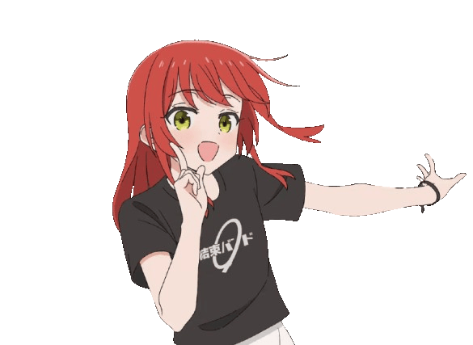
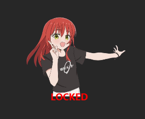
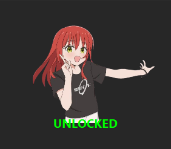

# ZX Anim (v2.0)

**ZX Anim** is a lightweight, interactive animation overlay for rhythm games like **osu!**.
The animation reacts **in real time** to your keyboard inputs, making streams and taps visually synced on screen.

---

## Lock / Unlock State

---

## 🌟 New in v2.0
* ⚙️ **Dynamic Keybind Settings:** Change your active keys directly from the System Tray GUI (no need to edit JSON files!).
* 📉 **Optimized Performance:** Rebuilt with an event-driven MVC architecture for zero-lag input detection.
* 🗕 **System Tray Integration:** Runs cleanly in the background without cluttering your Taskbar.

## Features

* 🎮 Responsive animation synced with your custom key presses
* 🔒 Lock / Unlock window position (**HOME** key)
* 🖼️ Custom animation frames (PNG)
* 🔊 Custom lock / unlock sounds
* 🎥 OBS / screen recording compatible (Window Capture)
* 🪟 Frameless & transparent background overlay
* 💾 Auto-saves window position and settings

---

## How to Use

#### 1. Download or clone the repository
git clone [https://github.com/USERNAME/zx_anim.git](https://github.com/USERNAME/zx_anim.git)
cd zx_anim

Or download the ZIP file and extract it.

#### 2. Install dependencies
Make sure you have Python installed, then run:

pip install -r requirements.txt

#### 3. Run the App
python zx_anim.py

#### 4. Build the executable (Optional)
If you want to compile it into a single .exe file so you don't need Python installed next time, run this PyInstaller command:

pyinstaller --onefile --noconsole --icon=icon.ico --add-data "frames;frames" --add-data "lock.wav;." --add-data "unlock.wav;." zx_anim.py

* The executable will be generated in the dist/ folder.

## Controls & Usage
* Custom Keys (Default: Q / W) → Advance animation frame
* HOME → Lock / Unlock window position
* Mouse Drag → Move window (when unlocked)
* Mouse Scroll → Adjust animation frame speed
* Right-Click System Tray Icon → Open Settings Panel or Quit App

Notes
Designed as an overlay (frameless & transparent).
Works perfectly with OBS Window Capture.
Best used in borderless or fullscreen gameplay.